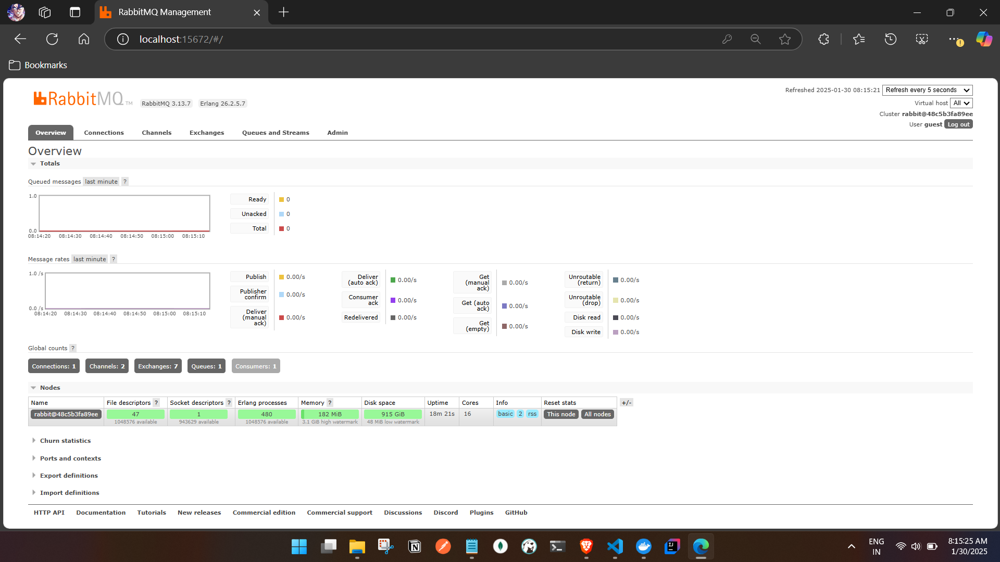

# Spring Boot with RabbitMQ

This project demonstrates how to integrate Spring Boot with RabbitMQ for message publishing and consuming.

## Prerequisites

- Docker
- Docker Compose
- Java 21
- Maven Springboot 3 project

## Getting Started

1. **Start the RabbitMQ server using Docker Compose:**

   ```sh
   docker-compose up -d
   ```

2. **Verify the RabbitMQ Management UI:**

   Open your browser and navigate to `http://localhost:15672`. Use the credentials specified in the 

application.yml



3. **Create the Spring Boot project and add dependencies:**

   The project already includes the necessary dependencies in the 

pom.xml

 file:
   - `spring-boot-starter-amqp`
   - `spring-boot-starter-web`

## Running the Application

1. **Build the project:**

   ```sh
   mvn clean install
   ```

2. **Run the application:**

   ```sh
   mvn spring-boot:run
   ```

## API Endpoints

- **Send Message:**

  ```http
  GET /api/messages/send?message=YourMessage
  ```

  Example:

  ```sh
  curl "http://localhost:8080/api/messages/send?message=Hello%20world"
  ```

## Configuration

The RabbitMQ configuration is specified in the 

application.yml

 file:

```yml
spring:
  rabbitmq:
    host: localhost
    port: 5672
    username: guest
    password: guest
```

## Additional Resources

### RabbitMQ:
- [Simplifying RabbitMQ Setup with Docker: A Step-by-Step Guide](https://medium.com/@buttraheel6/simplifying-rabbitmq-setup-with-docker-a-step-by-step-guide-9698dc9ea4ff)
- [RabbitMQ Docker](https://geshan.com.np/blog/2024/05/rabbitmq-docker/)

### Spring Boot:
- [Spring Boot Microservices with RabbitMQ Example](https://rameshfadatare.medium.com/spring-boot-microservices-with-rabbitmq-example-92a38cbe08fc)
- [Spring Boot Publisher-Subscriber RabbitMQ using Docker](https://dev.to/atharvasiddhabhatti/spring-boot-publisher-subscriber-rabbit-mq-using-docker-117a)
```
